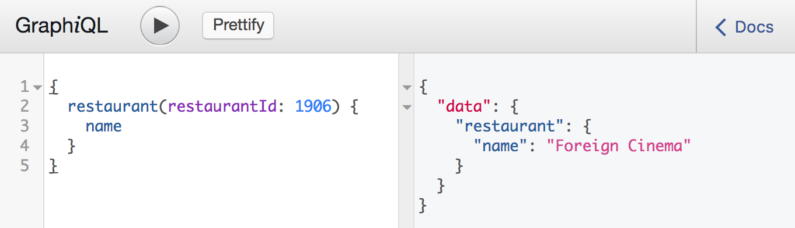
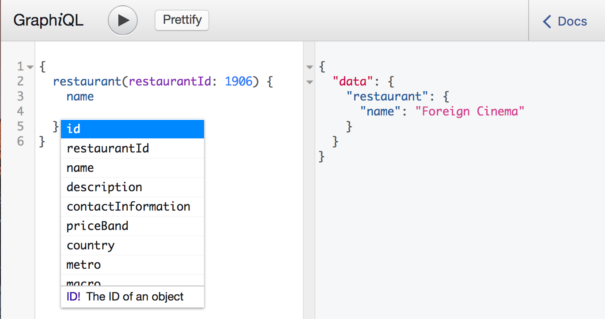
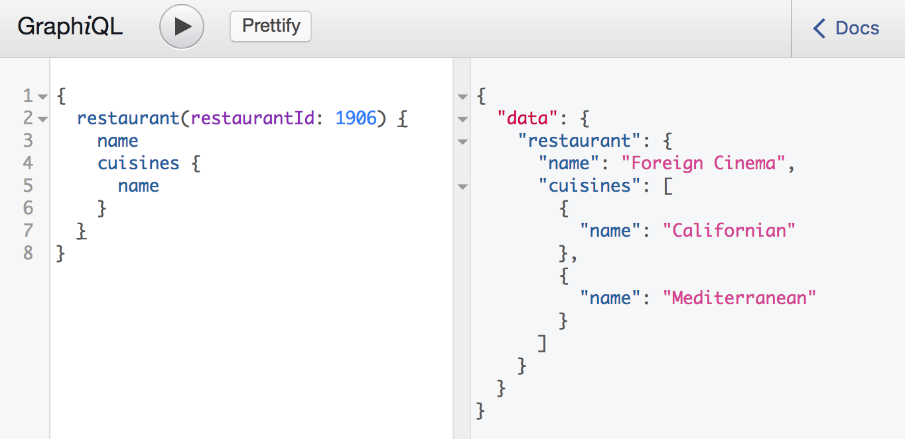

The best way to learn how GraphQL works is to try it out. Let's start by playing with GraphiQL, a powerful developer tool for testing out queries:

[https://www.opentable.com/graphiql](https://www.opentable.com/graphiql)

Copy the following query into the editor and hit the execute button:

```graphql
{
  restaurant(restaurantId: 1906) {
    name
  }
}
```

You should get a JSON response which matches your query:



Let's extend our restaurant query to get a feel for the GraphiQL editor; try pressing Ctrl-Space after the restaurant name to see what fields are available:



How about getting the restaurant cuisines:

```graphql
{
  restaurant(restaurantId: 1906) {
    name
    cuisines {
      name
    }
  }
}
```

After executing the query you will see a list of cuisines for the restaurant:



GraphiQL's intellisense feature is an excellent way to discover the capabilities of a GraphQL API, but it's also worth taking a look at the Documentation Explorer by clicking on the "Docs" button in the top right corner:


Have a play with the API, explore the schema and see what queries you can write. If you get stuck try adapting the following complex query:

```graphql
{
  restaurant(restaurantId: 1906) {
    name
    cuisines {
      name
    }
    priceBand {
      name
    }
    country {
      name
    }
    metro {
      name
    }
    macro {
      name
    }
    neighborhood {
      name
    }
    messages {
      standardMessages {
        confirmation {
          message
        }
      }
    }
    menus {
      title
      sections {
        items {
          title
        }
      }
    }
    reviews(offset: 0, limit: 2) {
      description
      rating {
        overall
      }
    }
  }
  metro (metroId: 4) {
    name
    pointsOfInterest {
      name
    }
  }
}
```

Learn more here:
* [http://graphql.org/](http://graphql.org/) - A great high level overview as well as detailed documentation on writing queries.
* [https://github.com/chentsulin/awesome-graphql](https://github.com/chentsulin/awesome-graphql) - The go to resource for everything that's going on in the GraphQL community.
* [http://dev.apollodata.com](http://dev.apollodata.com) - A client library for GraphQL with excellent React.js support.